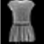

# TFDatasets

`TFDatasets` is a collection of scripts to preprocess various Computer Vision datasets and convert them to `TFRecords` for easy integration in the `tf.data.Dataset` pipeline. The code was designed with Python 3+ and tensorflow 1.4+ in mind.

The notebook `load_datasets.ipynb` displays examples of writing and parsing TFRecords for each dataset. See the last section of this readme for an index of available datasets.

The notebook `preprocess.ipynb` displays of example of various preprocessing utilities for `tf.data.Dataset` (adding random crops, occlusion generation, subsampling etc.) demonstrated on the mnist dataset.

---

### Table of Contents

| Dataset | Link | Example | TFRecords contents |
| :-----: | :--: | :-----: | :----------------: |
| ACwS | [Apparel Classification with Style](http://www.vision.ee.ethz.ch/~lbossard/projects/accv12/index.html) |  | image, class |
| CartoonSet | [CartoonSet](https://google.github.io/cartoonset/) |  | image, bounding-box, attributes |
| CelebA | [CelebA](http://mmlab.ie.cuhk.edu.hk/projects/CelebA.html) |  | image, bounding-box, attributes, landmarks |
| CIFAR-10(0) | [CIFAR](https://www.cs.toronto.edu/~kriz/cifar.html) |  | image, class, (coarse_class), (coarse_)class-name, |
| Fashion MNIST| [Fashion MNIST](https://github.com/zalandoresearch/fashion-mnist) |  | image, class, index|
| MNIST | [MNIST](http://yann.lecun.com/exdb/mnist/) |  | image, digit-class, index |
| MNIST-M | [MNIST-M](http://yaroslav.ganin.net/) |  | image, digit-class, index |
| M2NIST | [M2NIST](https://www.kaggle.com/farhanhubble/multimnistm2nist/home) |  | image, segmentation-mask, index |
| PACS | [PACS](http://www.eecs.qmul.ac.uk/~dl307/project_iccv2017) |  | image, content-class, style-class |
| SVHN | [SVHN](http://ufldl.stanford.edu/housenumbers/) |  | image, digit-class, index |
| Tiny ImageNet | [Tiny ImageNet](https://tiny-imagenet.herokuapp.com/) |  | image, class, class-name, bounding-box |
| VisDA | [VisDA](http://ai.bu.edu/visda-2017/) |  | image, class |

---

### Notes on the API

The module for a dataset `data` is contained in `dataset_utils.data.py`. It contains three main objects: a `Features` description, a `Converter` and a `Loader`.

#### Features
A `Features` object defines the content of a TFRecord example. It is initialized from a list of tuples, where each tuple represents a feature as:
  * **name:** a name, which will be the corresponding feature key in the parsed dictionnary
  * **type:** the type of the feature, one of int, float or bytes (see `tfrecords_utils.FeatureType`)
  * **length:** whether the tuple should be of fixed or variable length (see `tfrecords_utils.FeatureLength`)
  * **shape:** if the length is fixed, the shape of the feature, which is a nested list of integers.
  * **default:** A default value for the Records when loading (or `None` if no missing data)

#### Converter
A converter object contains one main method, `convert` that generates the TFRecords.

It generally takes as arguments
  * **target_path**, the path where to solve the TFRecords to.
  * **compression_type**, one of None, 'gzip' or 'zlib', that determines the compression option for the TFRecords. 
  * **save_image_in_records**, a boolean which indicates whether to store the image directly in the TFRecords; if the images are large, it can be useful to compress the TFRecords using `compression_type`. Otherwise, if that argument is `False`, the function only stores the path to the image, which will then be loaded by the `tf.data.Dataset` object.
  
 Additionally, in some cases this method takes a keyword argument `sort`; If this is `True`, the entries in the TFRecords will be sorted in someway, e.g. by class labels. Note that this means the `shuffle_buffer` size should be at least equal to the number of samples in the dataset for proper shuffling (hence not optimal for large datasets), but it can be convenient to quickly filter/sample the dataset based on classes.

#### Loader
A `Loader` object simply builds a proper parsing function to extract data from the TFRecords and format it correctly. Such a function can then be passed to the `tf.data.Dataset` API `map` function to parse the TFRecords dataset.
